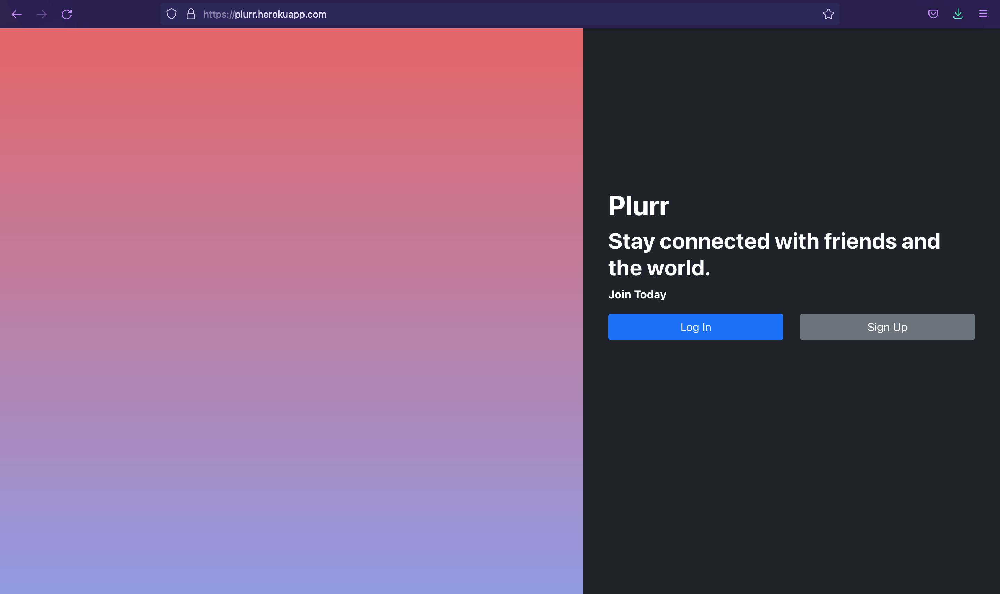

CMPUT404-project-socialdistribution
===================================

CMPUT404-project-socialdistribution

See project.org (plain-text/org-mode) for a description of the project.

Make a distributed social network!

## Developers
|  |  |  |  | 
| :---:   | :---: | :---: | :---: |
| **Ayo - aakindel**| **Mahmood - MahmoodFalmaz**| **Mahmoud - MahmoudAJ2000**| **Zubier - Head8che**|

## Heroku
[https://plurr.herokuapp.com](http://plurr.herokuapp.com)

Documentation
============
[Plurr Wiki](https://github.com/aakindel/CMPUT404-project-socialdistribution/wiki/API-Documentation)

Video Demo
============

Contributing
============

Send a pull request and be sure to update this file with your name.

Contributors / Licensing
========================

Generally everything is LICENSE'D under the Apache 2 license by Abram Hindle.

All text is licensed under the CC-BY-SA 4.0 http://creativecommons.org/licenses/by-sa/4.0/deed.en_US

Contributors:

    Karim Baaba
    Ali Sajedi
    Kyle Richelhoff
    Chris Pavlicek
    Derek Dowling
    Olexiy Berjanskii
    Erin Torbiak
    Abram Hindle
    Braedy Kuzma
    Nhan Nguyen 
